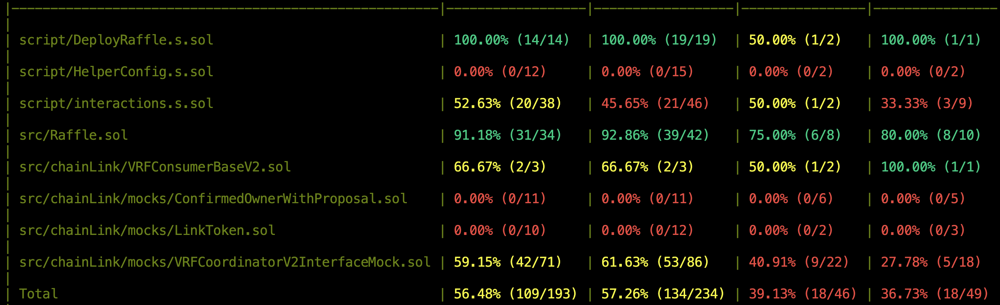
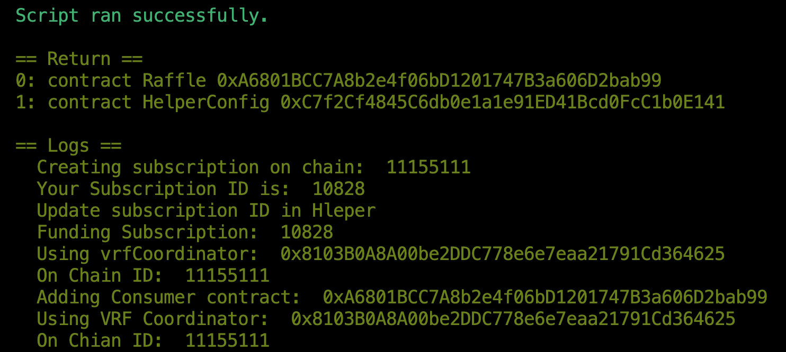

# Run a Lottery via Foundry Smart Contract 

Following Patrick Collins tutorial: 
- https://updraft.cyfrin.io/courses/foundry/smart-contract-lottery/setup

## Smart Contracts description
### src/Raffle.sol: 
The Raffle has 2 states coded as ENUM:
```shell
 enum RaffleState {
        OPEN, //0
        CALCULATING //1
    }
```
When Open Players can get in the raffle by paying an entrance fee and they will be tracked via array:
```shell
address payable[] private s_players;
```
The winner will be picked randomnly via ChainlinkVRF (Verifiable Random Function) during calculation state and the process to call the random number is automated via chainlink Upkeep:
```shell
import {VRFCoordinatorV2Interface} from "./chainLink/interfaces/VRFCoordinatorV2Interface.sol";
import {VRFConsumerBaseV2} from "./chainLink/VRFConsumerBaseV2.sol";
```
Once Winner is winner is selected all the Raffle.balance collected via entrance fee is transfered to the winner.

### script/DeployRaffle.s.sol:
The contract will 
-   **Deploy**: via run function
-   **Create Subscription**: for the ChainlinkVRF service to get the random number
-   **Fund the Subscription**: Link need to sent to VRF Coordinator

### script/HelperConfig.s.sol:
It manages the network we are deploying to:
-   **Sepolia**:
-   **Anvil**:
Providing neccessary inputs like VRFCoordinator and Link coin address or subscription ID. 

### script/Interactions.s.sol:
It provides the functions consumed by DeployRaffle.sol via 3 contracts:
-   **CreateSubscription**
-   **FundSubscription**
-   **AddConsumer**

## Tests
Mainly focused on Uint tests. If you run 
```shell
$ forge coverage
```


## Deploy the Raffle.sol in Testnet
The contract has been deployed via Makefile:
```shell
$ make deploy ARGS="--network sepolia"
```
Where it scipts:
```shell
deploy:
	@forge script script/DeployRaffle.s.sol:DeployRaffle $(NETWORK_ARGS)
```
And for Sepolia:
```shell
NETWORK_ARGS := --rpc-url $(SEPOLIA_RPC_URL) --private-key $(PRIVATE_KEY) --broadcast --verify --etherscan-api-key $(ETHERSCAN_API_KEY) -vvvv
```
The contract is viseable at:
- https://sepolia.etherscan.io/address/0xa6801bcc7a8b2e4f06bd1201747b3a606d2bab99

The results in the terminal as follow:


## YOU CAN PLAY AND WIN :)